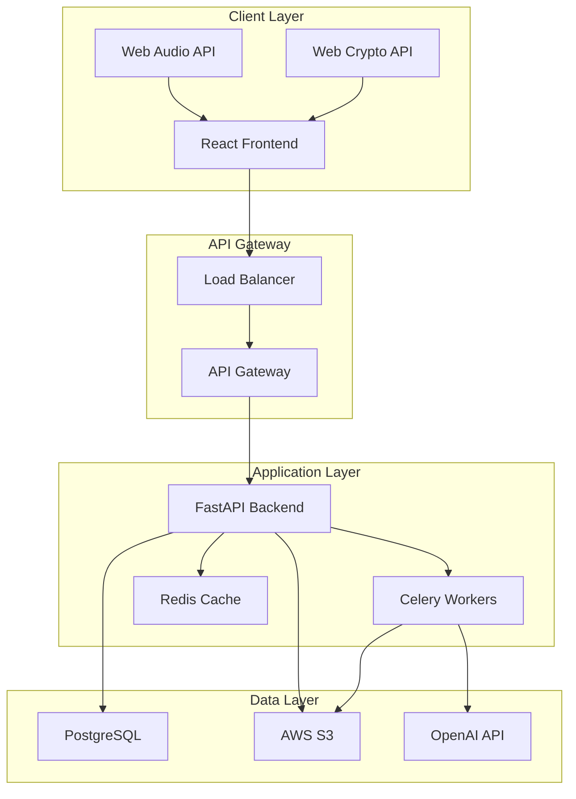
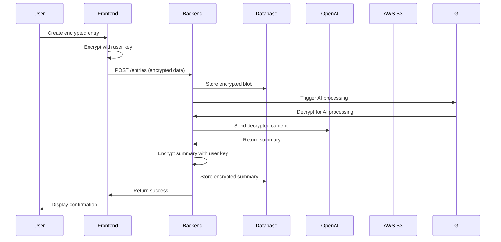
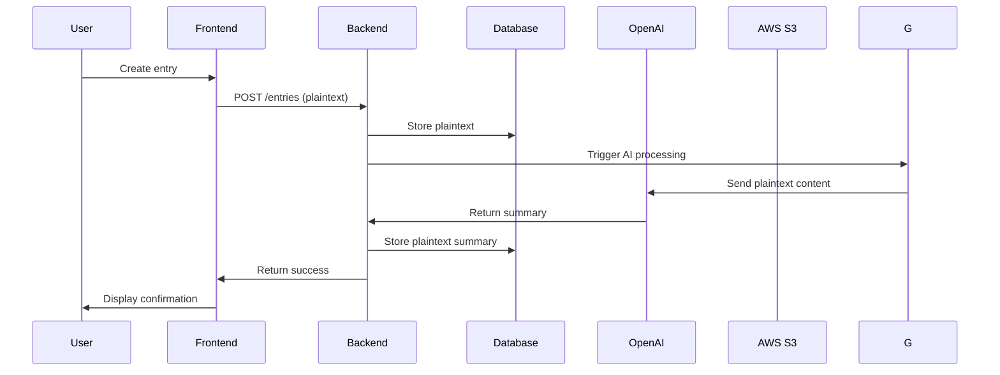
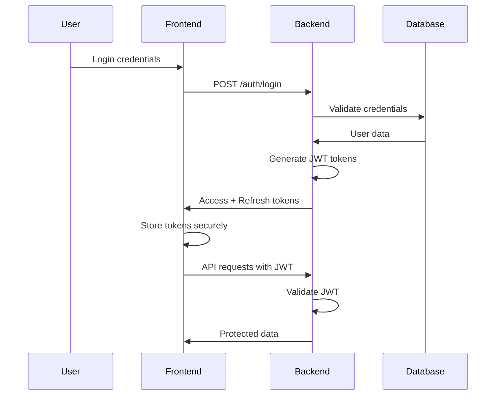
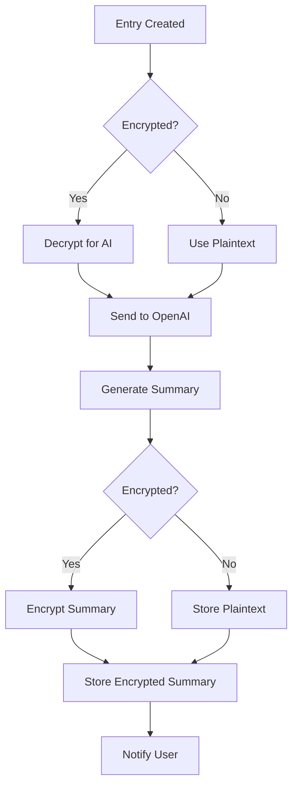
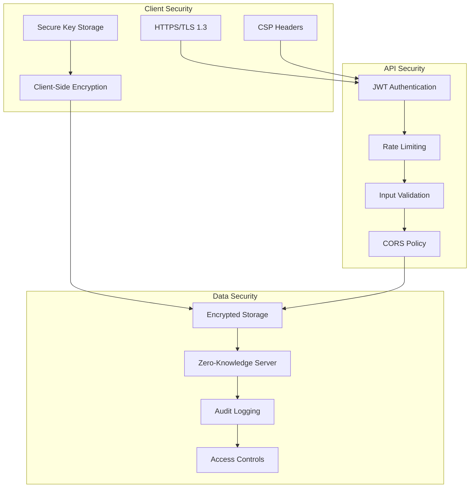
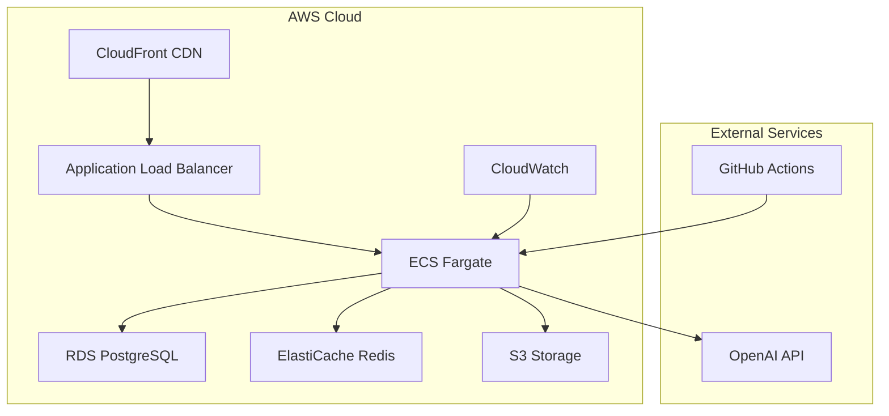
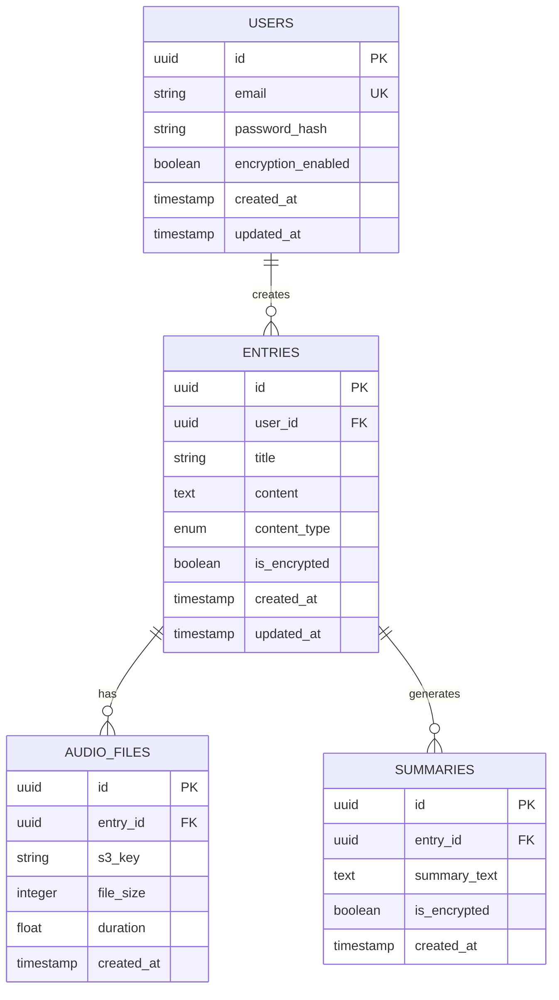
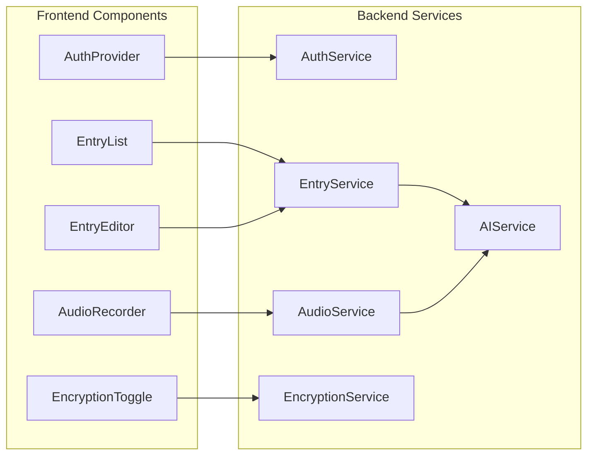
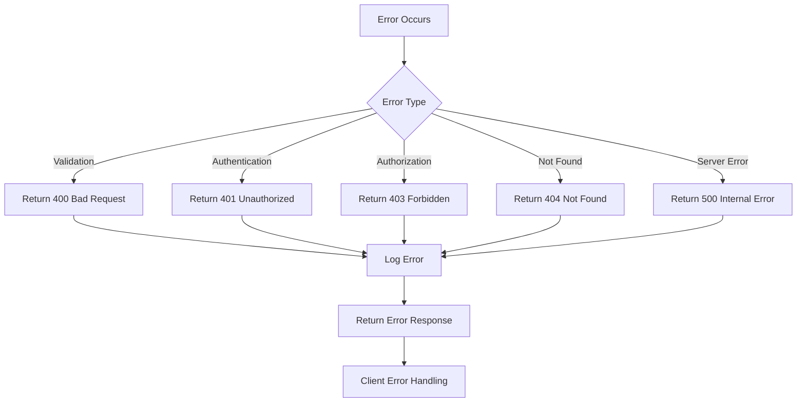

# EchoNote Architecture Diagrams

## System Architecture Overview

## Data Flow - Encrypted Mode

## Data Flow - Unencrypted Mode

## Authentication Flow

## AI Processing Pipeline

## Security Architecture

## Deployment Architecture

## Database Schema

## Component Interaction

## Error Handling Flow

